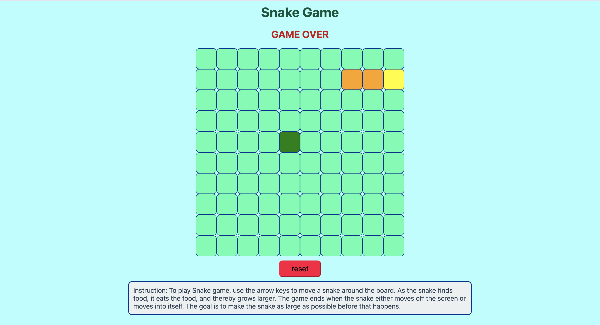
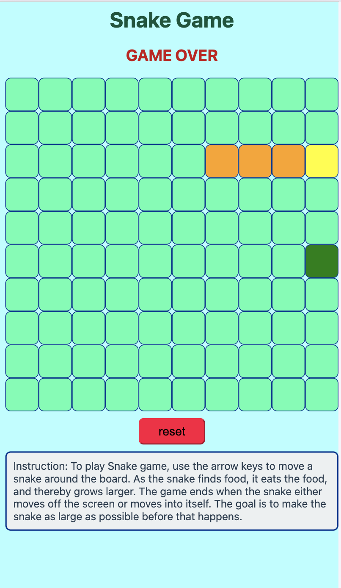

# Snake Game
This game is the good old snake game that probably everyone played at some point in the time.

# Instructions:
In this game, there is:
- A board of 10 by 10 
- A snake that can move around the board, and its direction can change by pressing arrow keys on keyboard
- Random food on the board, that can be eaten by the snake, once the snake eats the food, its lenght increases by one, and a new food will be placed on the board
- The snake **Head** should not cross the borders (walls), otherwise the game is over
- The snake **Head** should not hit its body (tails), otherwise the game is over
- A snake that can move around
### To play this game, please click this link:
https://manijehshirzadeh.github.io/snake-game/

# Technologies:
- HTML
- CSS
- JavaScript

# External resources:
- Choosing color from a color pallet : https://coolors.co/defffc-e2e4f6-e7c8dd-dbafc1-86626e
- For using different JavaScript methods in this project: https://developer.mozilla.org/en-US/

# Next Steps:
- Adding transition to the move of the snake
- Adding sound to the game